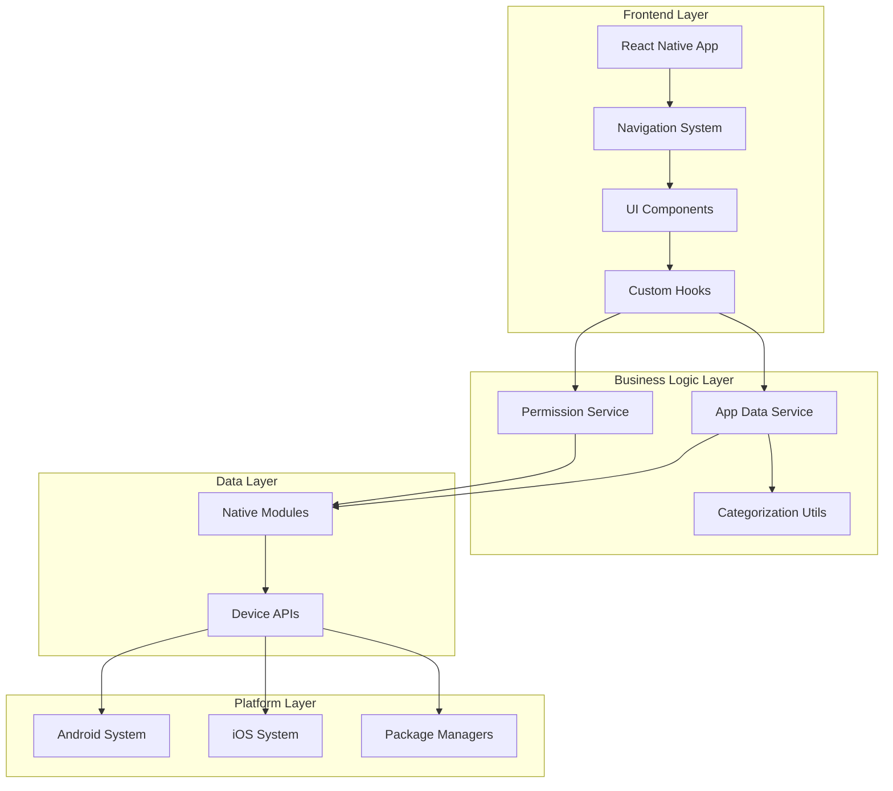

# Monitor Mate - Complete Application Documentation

## Table of Contents
1. [Application Overview](#application-overview)
2. [System Architecture](#system-architecture)
3. [Feature Specifications](#feature-specifications)
4. [Technical Implementation](#technical-implementation)
5. [Security & Privacy](#security--privacy)
6. [Installation & Setup](#installation--setup)
7. [Usage Guidelines](#usage-guidelines)
8. [API Documentation](#api-documentation)
9. [Testing & Quality Assurance](#testing--quality-assurance)
10. [Deployment & Maintenance](#deployment--maintenance)

## Application Overview

### Purpose
Monitor Mate is a comprehensive mobile application security and monitoring solution designed to help users understand, analyze, and manage the privacy and security implications of applications installed on their mobile devices.

### Key Capabilities
- **App Permission Analysis**: Detailed analysis of app permissions with risk assessment
- **Security Monitoring**: Real-time security status and risk categorization
- **Privacy Protection**: Identification of privacy-sensitive applications
- **Data Usage Tracking**: Monitoring of app data consumption patterns
- **User-Friendly Interface**: Intuitive dashboard with actionable insights

### Target Platforms
- **Android**: Primary platform with comprehensive monitoring capabilities
- **iOS**: Secondary platform with privacy-compliant monitoring
- **React Native**: Cross-platform compatibility

## System Architecture

### High-Level Architecture



### Component Architecture

#### Frontend Components
- **Screens**: Full-screen UI components (Dashboard, AppDetail, Settings, etc.)
- **Components**: Reusable UI elements (Cards, Buttons, Lists)
- **Navigation**: Stack-based navigation system
- **Hooks**: Custom React hooks for state management

#### Service Layer
- **AppDataService**: Central app data management
- **PermissionService**: Permission analysis and risk assessment
- **Categorization**: App classification algorithms

#### Data Integration
- **Native Modules**: Platform-specific data access
- **API Abstraction**: Unified data access interface

## Feature Specifications

### Dashboard Features

#### Security Overview Cards
- **Total Apps Counter**: Real-time count of installed applications
- **Security Status Indicator**: Overall device security assessment
- **Risk Distribution**: Visual breakdown of apps by risk category

#### Risk Category Grid
- **High Risk Apps**: Apps with multiple privacy-sensitive permissions
- **Medium Risk Apps**: Apps with moderate permission requirements
- **Low Risk Apps**: Apps with minimal permission needs
- **No Risk Apps**: Apps with no concerning permissions

#### Recent Apps Section
- **Usage Timeline**: Recently accessed applications
- **Data Usage Indicators**: Visual data consumption metrics with progress bars
- **Relative Usage Bars**: Progress bars showing data usage relative to highest-consuming app
- **Quick Access**: Direct navigation to app details

#### Data Usage Progress Bars
The recent apps display includes visual progress bars that show:
- **Relative Data Usage**: Each app's data consumption compared to the app using most data
- **Visual Comparison**: Easy visual comparison between apps' data usage
- **4px Progress Bars**: Compact horizontal bars with blue fill (`#3b82f6`)
- **Percentage-based Fill**: Width calculated as percentage of maximum usage among recent apps

### App Detail Features

#### Comprehensive App Information
- **Basic Details**: Name, version, package identifier, installation date
- **Icon Display**: App icon with fallback placeholder system
- **Category Classification**: Automatic app categorization

#### Permission Analysis
- **Risk Assessment**: Color-coded risk level indicators
- **Permission Breakdown**: Detailed list of all app permissions
- **Security Recommendations**: Actionable security advice
- **Risk Explanations**: Clear descriptions of permission implications

#### Usage Analytics
- **Last Used Timestamp**: When the app was last accessed
- **Data Usage Statistics**: Network consumption metrics
- **Storage Information**: App size and data footprint

### Permission Management

#### Risk-Based Classification
```
HIGH RISK (Red): Privacy-critical permissions
- Camera, Microphone, Location, Contacts, Phone, SMS

MEDIUM RISK (Orange): Data access permissions  
- Storage, Calendar, Sensors

LOW RISK (Yellow): Basic system permissions
- Network access, basic system functions

NO RISK (Green): No concerning permissions
```

#### Permission Recommendations
- **Critical Alerts**: For apps with multiple high-risk permissions
- **Advisory Warnings**: For privacy-sensitive applications
- **Safety Confirmations**: For low-risk applications
- **Action Guidance**: Steps to manage permissions

### App Categorization System

#### Automated Classification
- **24 App Categories**: Comprehensive classification system
- **Pattern Matching**: Package name and keyword analysis
- **Fallback Logic**: Graceful handling of unknown apps

#### Categories Include:
- Social, Communication, Entertainment, Productivity
- Shopping, Finance, Health & Fitness, Education
- News, Travel, Photo & Video, Music, Games
- Utilities, Business, Lifestyle, Weather, Sports
- Books, Medical, Navigation, System, Other

## Technical Implementation

### React Native Architecture

#### Core Dependencies
```json
{
  "react": "19.0.0",
  "react-native": "0.79.2",
  "@react-navigation/native": "^7.1.9",
  "@react-navigation/native-stack": "^7.3.13",
  "react-native-permissions": "^5.4.2",
  "react-native-device-info": "^14.1.1"
}
```

#### Custom Hooks Implementation
```javascript
// useAppInfo Hook
const useAppInfo = () => {
  const [loading, setLoading] = useState(false);
  const [error, setError] = useState(null);
  
  // App data retrieval
  const getInstalledApps = useCallback(async () => {
    // Implementation details
  }, []);
  
  // Risk analysis
  const categorizeAppsByRisk = useCallback((apps) => {
    // Implementation details
  }, []);
  
  return {
    loading,
    error,
    getInstalledApps,
    categorizeAppsByRisk,
    // Additional methods
  };
};
```

### Permission Analysis Algorithm

#### Risk Scoring System
```javascript
const calculateRiskScore = (permissions) => {
  let score = 0;
  let highRiskCount = 0;
  let mediumRiskCount = 0;
  
  permissions.forEach(permission => {
    const risk = PERMISSION_RISKS[permission];
    if (risk) {
      switch (risk.level) {
        case 'HIGH':
          score += 3;
          highRiskCount++;
          break;
        case 'MEDIUM':
          score += 2;
          mediumRiskCount++;
          break;
        case 'LOW':
          score += 1;
          break;
      }
    }
  });
  
  // Determine overall risk level
  if (highRiskCount >= 3 || score >= 8) {
    return 'HIGH_RISK';
  } else if (highRiskCount >= 1 || score >= 4) {
    return 'MEDIUM_RISK';
  } else if (score >= 1) {
    return 'LOW_RISK';
  } else {
    return 'NO_RISK';
  }
};
```

### UI/UX Implementation

#### Modern Design System
```javascript
const styles = StyleSheet.create({
  // Card-based layout
  card: {
    backgroundColor: '#ffffff',
    borderRadius: 16,
    padding: 18,
    marginBottom: 18,
    shadowColor: '#000',
    shadowOffset: { width: 0, height: 4 },
    shadowOpacity: 0.1,
    shadowRadius: 8,
    elevation: 3,
  },
  
  // Risk-based color coding
  highRisk: { backgroundColor: '#ef4444' },
  mediumRisk: { backgroundColor: '#f59e0b' },
  lowRisk: { backgroundColor: '#eab308' },
  noRisk: { backgroundColor: '#22c55e' },
});
```

#### Responsive Components
- **Adaptive Layouts**: Screen size optimization
- **Touch Targets**: Accessibility-compliant interactive elements
- **Visual Hierarchy**: Clear information organization
- **Loading States**: Graceful loading and error handling

## Security & Privacy

### Privacy-First Design

#### Data Processing Principles
- **Local-Only Analysis**: All app analysis performed on-device
- **No External Transmission**: App data never leaves the device
- **User Consent**: Clear permission explanations and user control
- **Transparent Algorithms**: Open-source analysis methods

#### Security Measures
- **Minimal Data Collection**: Only essential information gathered
- **Secure Storage**: No persistent storage of sensitive data
- **Permission-Based Access**: User-controlled access to device features
- **Regular Security Reviews**: Ongoing security assessment

### Privacy Compliance

#### Platform Compliance
- **Android Privacy Guidelines**: Adherence to Android privacy requirements
- **iOS App Store Guidelines**: Compliance with Apple privacy standards
- **GDPR Considerations**: European privacy regulation compliance
- **User Rights**: Data access and deletion capabilities

#### Permission Handling
```javascript
// Android Permission Request
const requestPermissions = async () => {
  try {
    const grants = await PermissionsAndroid.requestMultiple([
      PermissionsAndroid.PERMISSIONS.READ_PHONE_STATE,
      PermissionsAndroid.PERMISSIONS.ACCESS_NETWORK_STATE,
    ]);
    return grants;
  } catch (error) {
    console.error('Permission request failed:', error);
    return {};
  }
};
```

## Installation & Setup

### Development Environment Setup

#### Prerequisites
```bash
# Required Software
Node.js >= 18.0.0
React Native CLI
Android Studio (for Android development)
Xcode (for iOS development, macOS only)
```

#### Installation Steps
```bash
# Clone repository
git clone <repository-url>
cd Mobile-Monitor

# Install dependencies
npm install

# iOS setup (macOS only)
cd ios
pod install
cd ..

# Start Metro bundler
npm start

# Run on Android
npm run android

# Run on iOS
npm run ios
```

#### Configuration Files
- **package.json**: Project dependencies and scripts
- **metro.config.js**: Metro bundler configuration
- **babel.config.js**: Babel transformation settings
- **tsconfig.json**: TypeScript configuration
- **android/**: Android-specific configuration
- **ios/**: iOS-specific configuration

### Production Build

#### Android Build
```bash
# Generate signed APK
cd android
./gradlew assembleRelease

# Generate AAB for Play Store
./gradlew bundleRelease
```

#### iOS Build
```bash
# Build for App Store
npx react-native run-ios --configuration Release
# Use Xcode for final App Store submission
```

## Usage Guidelines

### User Onboarding

#### First Launch Experience
1. **Welcome Screen**: Introduction to app capabilities
2. **Permission Setup**: Guided permission configuration
3. **Initial Scan**: First app analysis and categorization
4. **Dashboard Introduction**: Feature explanation and navigation

#### Key User Workflows

**Monitoring App Security**
1. Launch Monitor Mate
2. Review security status on dashboard
3. Examine risk category distributions
4. Investigate high-risk applications
5. Follow security recommendations

**Analyzing Specific Apps**
1. Navigate to app list or select from recent apps
2. Choose specific application for analysis
3. Review permission breakdown
4. Understand risk implications
5. Take recommended actions

**Managing Device Security**
1. Regular dashboard reviews
2. Monitor new app installations
3. Review permission changes
4. Update security settings as needed
5. Follow best practices recommendations

### Best Practices for Users

#### Regular Monitoring
- **Weekly Reviews**: Check dashboard for security changes
- **New App Analysis**: Analyze permissions before installing new apps
- **Permission Audits**: Regularly review and adjust app permissions
- **Security Updates**: Keep the monitoring app updated

#### Privacy Protection
- **High-Risk App Awareness**: Understand implications of high-risk apps
- **Permission Minimization**: Grant only necessary permissions
- **Regular Clean-up**: Remove unused applications
- **Data Usage Monitoring**: Track and limit data-intensive apps

## API Documentation

### Service APIs

#### AppDataService Methods

```javascript
// Get all installed applications
async getInstalledApps(): Promise<App[]>

// Get detailed app information
async getAppDetails(packageName: string): Promise<AppDetails | null>

// Categorize apps by risk level
categorizeAppsByRisk(apps: App[]): RiskCategories

// Get recently used apps
getRecentApps(apps: App[], limit: number = 5): App[]

// Search apps by name or package
searchApps(apps: App[], query: string): App[]

// Get apps by category
getAppsByCategory(apps: App[], category: string): App[]

// Get system statistics
getSystemStats(apps: App[]): SystemStats
```

#### PermissionService Methods

```javascript
// Analyze app risk based on permissions
static analyzeAppRisk(permissions: string[]): RiskAnalysis

// Get detailed permission analysis
static getPermissionAnalysis(permissions: string[]): PermissionAnalysis

// Get permission recommendation
static getPermissionRecommendation(permission: string, riskLevel: string): string

// Get app recommendations
static getAppRecommendations(riskAnalysis: RiskAnalysis): Recommendation[]

// Check system permissions
static async checkPermissions(): Promise<PermissionStatus>

// Request system permissions
static async requestPermissions(): Promise<PermissionGrants>
```

### Data Types

#### App Interface
```typescript
interface App {
  id: string;
  name: string;
  icon: string | null;
  packageName: string;
  lastUsedTimestamp: number;
  permissions: string[];
  category: string;
  installDate: string | null;
  version: string;
  totalTimeInForeground: number;
  size: number | null;
  riskAnalysis: RiskAnalysis;
}
```

#### RiskAnalysis Interface
```typescript
interface RiskAnalysis {
  riskLevel: 'HIGH_RISK' | 'MEDIUM_RISK' | 'LOW_RISK' | 'NO_RISK';
  riskScore: number;
  highRiskCount: number;
  mediumRiskCount: number;
  lowRiskCount: number;
  riskFactors: RiskFactor[];
}
```

#### PermissionAnalysis Interface
```typescript
interface PermissionAnalysis extends RiskAnalysis {
  permissionDetails: PermissionDetail[];
  recommendations: Recommendation[];
}
```

## Testing & Quality Assurance

### Testing Strategy

#### Unit Testing
```javascript
// Jest configuration
module.exports = {
  preset: 'react-native',
  setupFilesAfterEnv: ['<rootDir>/jest.setup.js'],
  transformIgnorePatterns: [
    'node_modules/(?!(react-native|@react-native|react-navigation)/)'
  ],
};

// Example test
describe('PermissionService', () => {
  it('should correctly analyze high-risk app', () => {
    const permissions = ['CAMERA', 'LOCATION', 'MICROPHONE', 'CONTACTS'];
    const analysis = PermissionService.analyzeAppRisk(permissions);
    expect(analysis.riskLevel).toBe('HIGH_RISK');
    expect(analysis.highRiskCount).toBe(4);
  });
});
```

#### Integration Testing
- **Service Integration**: Test service layer interactions
- **Navigation Testing**: Verify screen navigation flows
- **Permission Testing**: Test permission request flows

#### User Interface Testing
- **Component Testing**: Individual component functionality
- **Screen Testing**: Full screen rendering and interaction
- **Accessibility Testing**: Screen reader and accessibility compliance
- **Responsive Testing**: Multiple screen sizes and orientations


## Deployment & Maintenance

### Deployment Pipeline

#### Development Workflow
```bash
# Development build
npm run start

# Testing build
npm run test

# Production build
npm run build:android
npm run build:ios
```

#### Release Process
1. **Code Review**: Peer review of all changes
2. **Testing**: Comprehensive testing suite execution
3. **Build Generation**: Production build creation
4. **Store Submission**: App store submission process
5. **Release Monitoring**: Post-release monitoring and support

### Maintenance Guidelines

#### Regular Updates
- **Security Updates**: Regular security patch releases
- **Feature Updates**: New feature development and deployment
- **Bug Fixes**: Issue resolution and patch releases
- **Performance Improvements**: Ongoing optimization efforts
- **Code Quality**: Continuous code cleanup and lint compliance
- **Debug Removal**: Ensure production builds are clean of debug artifacts

#### Monitoring & Analytics
- **Crash Monitoring**: Application crash tracking and resolution
- **Performance Monitoring**: App performance metrics tracking
- **User Feedback**: User review and feedback integration
- **Usage Analytics**: Feature usage and adoption tracking

#### Long-term Maintenance
- **Platform Updates**: React Native and platform dependency updates
- **Security Audits**: Regular security assessment and improvements
- **Feature Deprecation**: Removal of outdated features
- **API Updates**: Platform API changes and adaptations

### Support & Documentation

#### User Support
- **Help Documentation**: Comprehensive user guides
- **FAQ Section**: Common questions and answers
- **Contact Support**: User support contact methods
- **Community Forums**: User community and discussion

#### Developer Documentation
- **API Documentation**: Complete API reference
- **Architecture Guides**: System design documentation
- **Contribution Guidelines**: Open source contribution rules
- **Development Setup**: Developer environment setup guides

---

*This documentation is maintained and updated regularly to reflect the current state of the Monitor Mate application. For the latest updates and additional information, please refer to the project repository.*