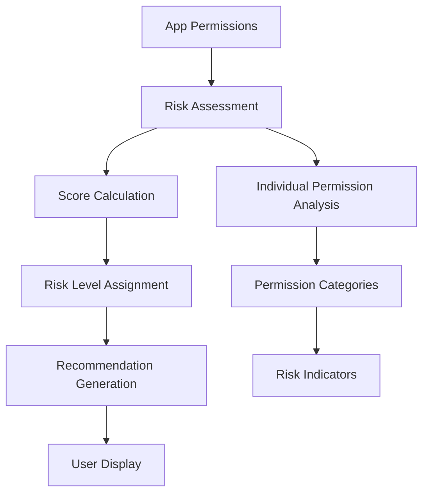

# Monitor Mate - Permission Management Documentation

## Overview

The Monitor Mate app implements a comprehensive permission management system that analyzes, categorizes, and provides security recommendations for mobile application permissions. This document details how permissions are managed, analyzed, and presented to users.

## Permission Management Architecture

### Core Components

#### 1. PermissionService.js
The central service responsible for permission analysis and risk assessment.

```javascript
// Location: src/services/PermissionService.js
export class PermissionService {
    static RISK_LEVELS = {
        HIGH: 'HIGH',     // Privacy-critical permissions
        MEDIUM: 'MEDIUM', // Moderate risk permissions  
        LOW: 'LOW'        // Basic system permissions
    };
}
```

#### 2. Permission Risk Categories

**HIGH RISK - Privacy Critical**
- **CAMERA**: Can take photos and videos without knowledge
- **LOCATION**: Can track location and movement patterns
- **MICROPHONE**: Can record audio and conversations
- **CONTACTS**: Can access personal contacts and relationships
- **PHONE**: Can access phone numbers and call information
- **SMS**: Can read and send text messages

**MEDIUM RISK - Data Access**
- **STORAGE**: Can access files and photos on device
- **CALENDAR**: Can view and modify calendar events
- **SENSORS**: Can access body sensors and health data

**LOW RISK - System**
- System-level permissions with minimal privacy impact

## Permission Analysis Process

### 1. Risk Scoring Algorithm

```javascript
// Scoring System:
HIGH permissions = 3 points each
MEDIUM permissions = 2 points each  
LOW permissions = 1 point each

// Risk Level Determination:
if (highRiskCount ≥ 3 OR totalScore ≥ 8) → HIGH_RISK
else if (highRiskCount ≥ 1 OR totalScore ≥ 4) → MEDIUM_RISK  
else if (totalScore ≥ 1) → LOW_RISK
else → NO_RISK
```

### 2. Permission Analysis Flow



### 3. Detailed Analysis Components

#### analyzeAppRisk(permissions)
```javascript
/**
 * Analyzes overall app risk based on permissions
 * @param {Array} permissions - Array of permission strings
 * @returns {Object} Risk analysis results
 */
return {
    riskLevel: 'HIGH_RISK' | 'MEDIUM_RISK' | 'LOW_RISK' | 'NO_RISK',
    riskScore: number,
    highRiskCount: number,
    mediumRiskCount: number, 
    lowRiskCount: number,
    riskFactors: [
        {
            permission: string,
            level: 'HIGH' | 'MEDIUM' | 'LOW',
            description: string,
            category: string
        }
    ]
}
```

#### getPermissionAnalysis(permissions)
```javascript
/**
 * Provides detailed permission breakdown with recommendations
 * @param {Array} permissions - Array of permission strings
 * @returns {Object} Comprehensive permission analysis
 */
return {
    ...riskAnalysis,
    permissionDetails: [
        {
            name: permission,
            level: riskLevel,
            description: riskDescription,
            category: permissionCategory,
            recommendation: recommendationText
        }
    ],
    recommendations: [
        {
            type: 'critical' | 'warning' | 'safe',
            title: string,
            message: string,
            action: string
        }
    ]
}
```

## Permission Categories & Descriptions

### Privacy Critical Permissions

**CAMERA Permission**
- **Risk Level**: HIGH
- **Category**: Privacy Critical
- **Description**: Can take photos and videos without your knowledge
- **Recommendation**: ⚠️ High Risk: Review why this app needs camera access. Consider alternatives or disable if not essential.
- **Icon**: 📷

**LOCATION Permission**
- **Risk Level**: HIGH  
- **Category**: Privacy Critical
- **Description**: Can track your location and movement patterns
- **Recommendation**: ⚠️ High Risk: Review why this app needs location access. Consider alternatives or disable if not essential.
- **Icon**: 📍

**MICROPHONE Permission**
- **Risk Level**: HIGH
- **Category**: Privacy Critical  
- **Description**: Can record audio and conversations
- **Recommendation**: ⚠️ High Risk: Review why this app needs microphone access. Consider alternatives or disable if not essential.
- **Icon**: 🎤

### Personal Data Permissions

**CONTACTS Permission**
- **Risk Level**: HIGH
- **Category**: Personal Data
- **Description**: Can access your personal contacts and relationships
- **Recommendation**: ⚠️ High Risk: Review why this app needs contacts access. Consider alternatives or disable if not essential.
- **Icon**: 👥

**PHONE Permission** 
- **Risk Level**: HIGH
- **Category**: Personal Data
- **Description**: Can access phone numbers and call information
- **Recommendation**: ⚠️ High Risk: Review why this app needs phone access. Consider alternatives or disable if not essential.
- **Icon**: 📞

### Communication Permissions

**SMS Permission**
- **Risk Level**: HIGH
- **Category**: Communications
- **Description**: Can read and send text messages
- **Recommendation**: ⚠️ High Risk: Review why this app needs SMS access. Consider alternatives or disable if not essential.
- **Icon**: 💬

### Data Access Permissions

**STORAGE Permission**
- **Risk Level**: MEDIUM
- **Category**: Data Access
- **Description**: Can access files and photos on your device
- **Recommendation**: ⚠️ Medium Risk: Monitor usage of storage access and review periodically.
- **Icon**: 💾

**CALENDAR Permission**
- **Risk Level**: MEDIUM
- **Category**: Personal Data
- **Description**: Can view and modify your calendar events
- **Recommendation**: ⚠️ Medium Risk: Monitor usage of calendar access and review periodically.
- **Icon**: 📅

### Health Data Permissions

**SENSORS Permission**
- **Risk Level**: MEDIUM
- **Category**: Health Data
- **Description**: Can access body sensors and health data
- **Recommendation**: ⚠️ Medium Risk: Monitor usage of sensors access and review periodically.
- **Icon**: ⌚

## User Interface Integration

### 1. Permission Display Components

#### RiskBadge Component
```javascript
// Visual risk level indicator with color coding
HIGH_RISK: Red background (#ef4444)
MEDIUM_RISK: Orange background (#f59e0b)  
LOW_RISK: Yellow background (#eab308)
NO_RISK: Green background (#22c55e)
```

#### Permission List Display
```javascript
// Individual permission items show:
- Permission icon (emoji-based)
- Formatted permission name
- Risk level indicator
- Description text
- Risk level badge
```

### 2. App Detail Screen Integration

**Permission Section Features:**
- Displays total permission count
- Lists all permissions with risk indicators
- Shows detailed descriptions on tap
- Provides risk-based recommendations
- Links to system permission settings

**Visual Elements:**
- Color-coded risk indicators
- Intuitive icons for each permission type
- Expandable permission details
- Action buttons for permission management

### 3. Dashboard Risk Visualization

**Risk Category Buttons:**
- High Risk Apps: Red styling, shows count
- Medium Risk Apps: Orange styling, shows count  
- Low Risk Apps: Yellow styling, shows count
- No Risk Apps: Green styling, shows count

**Security Status Card:**
- Overall security assessment
- Visual indicators (✓ for secure, ⚠ for at risk)
- Color-coded status display

## Platform-Specific Implementation

### Android Permission Handling

#### Standard Permissions
```javascript
checkPermissions() {
    // Checks standard Android permissions
    - READ_PHONE_STATE
    - ACCESS_NETWORK_STATE
    // Additional permissions as available
}

requestPermissions() {
    // Requests multiple permissions using PermissionsAndroid
    // Returns grant status for each permission
}
```

#### Usage Stats Permission
```javascript
checkUsageStatsPermission() {
    // Checks if usage statistics access is granted
    // Required for comprehensive app monitoring
}

requestUsageStatsPermission() {
    // Guides user to system settings for usage access
    // Shows explanatory dialog before redirect
}
```

### iOS Permission Handling

**Limited Capabilities:**
- iOS has stricter app monitoring restrictions
- Focus on user-granted permissions only
- Compliance with App Store guidelines
- Privacy-first approach

## Security Recommendations Engine

### 1. App-Level Recommendations

**High Privacy Risk (3+ high-risk permissions)**
```javascript
{
    type: 'critical',
    title: 'High Privacy Risk',
    message: 'This app has multiple high-risk permissions. Consider if you really need all these features.',
    action: 'Review permissions in device settings'
}
```

**Privacy Sensitive (1+ high-risk permissions)**
```javascript
{
    type: 'warning', 
    title: 'Privacy Sensitive',
    message: 'This app can access sensitive data. Monitor its behavior regularly.',
    action: 'Check app activity periodically'
}
```

**Low Privacy Impact (no high-risk permissions)**
```javascript
{
    type: 'safe',
    title: 'Low Privacy Impact', 
    message: 'This app has minimal privacy risks.',
    action: 'No immediate action needed'
}
```

### 2. Permission-Specific Recommendations

**HIGH Risk Permissions:**
```
⚠️ High Risk: Review why this app needs [permission] access. 
Consider alternatives or disable if not essential.
```

**MEDIUM Risk Permissions:**
```
⚠️ Medium Risk: Monitor usage of [permission] access and 
review periodically.
```

**LOW Risk Permissions:**
```
ℹ️ Low Risk: [permission] access is generally safe for 
this type of app.
```

## Data Privacy & Security

### Privacy Protection Measures

1. **Local Processing Only**: All permission analysis happens locally on the device
2. **No External Data Transfer**: Permission data never leaves the device
3. **User Consent**: Clear explanations for all permission requests
4. **Transparent Analysis**: Open-source algorithms for risk assessment
5. **User Control**: Users can disable monitoring features
6. **Clean Production Code**: All debug logging removed for production builds

### Security Best Practices

1. **Minimal Data Collection**: Only collect necessary permission information for analysis
2. **Secure Storage**: No persistent storage of sensitive permission data
3. **Regular Updates**: Keep permission risk assessments current with platform changes
4. **User Education**: Provide clear explanations of permission risks and implications
5. **Compliance**: Follow platform security guidelines (Android/iOS)
6. **Production Security**: Clean, optimized code without debug artifacts
7. **Error Handling**: Graceful fallbacks when native modules are unavailable

## Future Enhancements

### Planned Features

1. **Advanced Permission Tracking**: 
   - Real-time permission usage monitoring
   - Historical permission change tracking
   - Permission revocation suggestions

2. **Smart Recommendations**:
   - AI-powered risk assessment
   - Context-aware permission analysis
   - Personalized security recommendations

3. **Enhanced Visualization**:
   - Permission timeline views
   - Risk trend analysis
   - Interactive permission maps

4. **Parental Controls**:
   - Child-safe permission monitoring
   - Automatic risk alerts for parents
   - Age-appropriate app recommendations

### Technical Improvements

1. **Native Module Enhancement**: Better platform integration
2. **Performance Optimization**: Faster permission analysis
3. **Accessibility**: Improved screen reader support
4. **Internationalization**: Multi-language permission descriptions

## Troubleshooting

### Common Issues

**Permission Analysis Not Working**
- Check if native modules are properly linked
- Verify device permissions are granted
- Review app targets correct API levels

**Incorrect Risk Assessment**
- Verify permission mapping is up to date
- Check for new Android/iOS permission types
- Update risk algorithms as needed

**UI Display Issues**
- Check permission icon mappings
- Verify style calculations are correct
- Test on different screen sizes