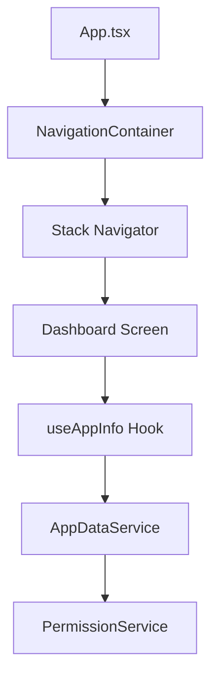
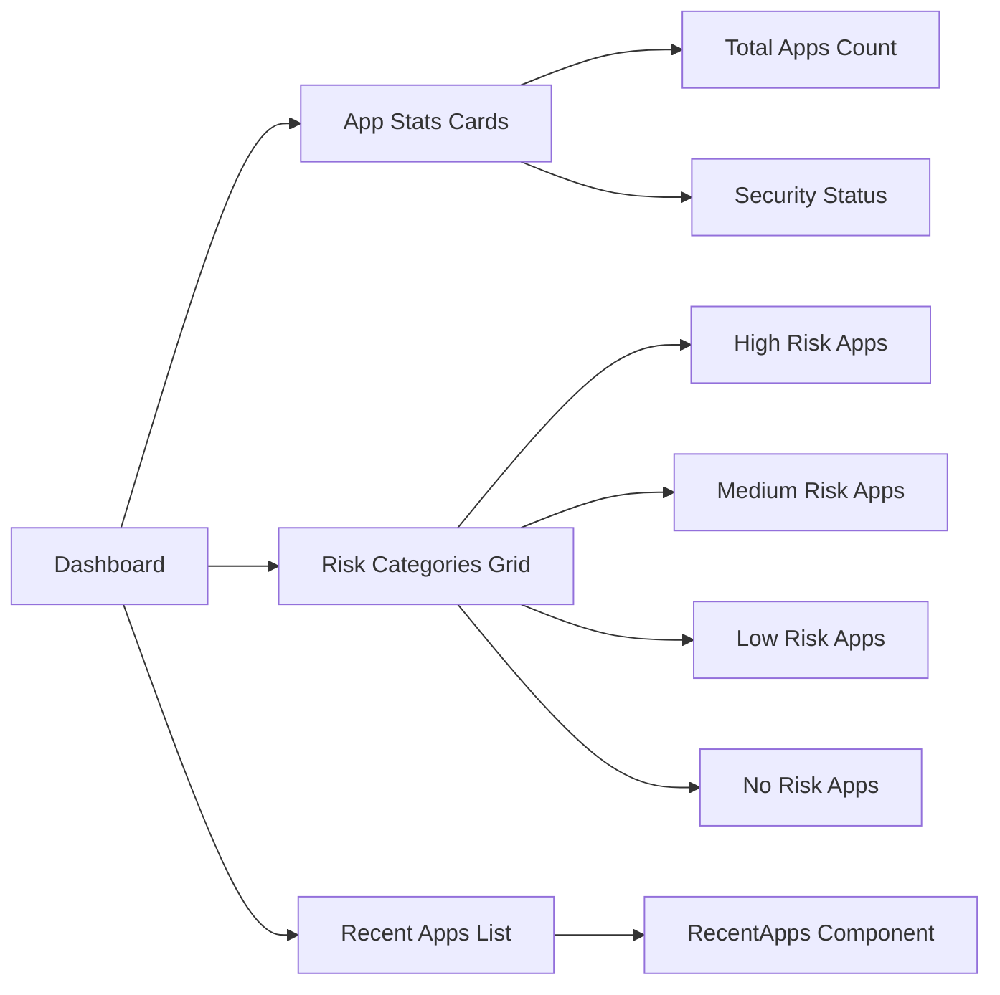
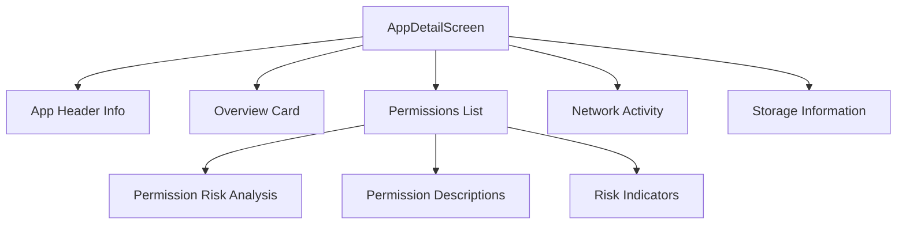

# Mobile Monitor - Technical Documentation

## Overview

Mobile Monitor is a React Native application designed to help users monitor and manage mobile applications on their devices. It provides comprehensive insights into app permissions, data usage, security risks, and overall device security status.

## Architecture Overview

### Technology Stack
- **Framework**: React Native 0.79.2
- **Navigation**: React Navigation v7
- **State Management**: React Hooks (useState, useCallback, useEffect)
- **Platform Support**: Android & iOS
- **JavaScript Engine**: Hermes (enabled)
- **Development**: TypeScript support enabled

### Project Structure
```
src/
├── components/
│   ├── common/
│   │   ├── LoadingIndicator.js
│   │   ├── RiskBadge.js
│   │   └── RiskCategoryButton.js
│   └── dashboard/
│       └── RecentApps.js
├── hooks/
│   ├── realUseApp.js
│   └── useAppInfo.js
├── screens/
│   ├── AppDetailScreen.js
│   ├── AppListScreen.js
│   ├── Dashboard.js
│   ├── DataUsageScreen.js
│   ├── MyAccount.js
│   ├── PermissionManagerScreen.js
│   ├── SecurityAlertsScreen.js
│   ├── SettingsScreen.js
│   └── onboarding/
│       ├── IntroScreen.js
│       └── PermissionSetupScreen.js
├── services/
│   ├── AppDataService.js
│   └── PermissionService.js
└── utils/
    └── appCategorization.js
```

## Detailed Technical Flow

### 1. Application Initialization


#### Entry Point (App.tsx)
- Sets up React Navigation with Stack Navigator
- Defines all screen routes
- Configures navigation options (headerShown: false for custom headers)

#### Navigation Structure
- **Initial Route**: Dashboard
- **Stack-based Navigation**: Native Stack Navigator
- **Custom Headers**: Each screen implements its own header design

### 2. Data Flow Architecture

#### Service Layer

**AppDataService.js**
- Primary data management service
- Handles app data retrieval and processing
- Processes app categorization and risk analysis

```javascript
// Core Methods:
- getInstalledApps(): Retrieves all installed apps
- getAppDetails(packageName): Gets detailed app information
- categorizeAppsByRisk(apps): Groups apps by risk level
- getRecentApps(apps, limit): Returns recently used apps
- searchApps(apps, query): Implements app search functionality
```

**PermissionService.js**
- Permission analysis and risk assessment
- Risk level calculations
- Permission categorization and recommendations

```javascript
// Risk Levels:
- HIGH: Privacy-critical permissions (CAMERA, LOCATION, MICROPHONE, CONTACTS, PHONE, SMS)
- MEDIUM: Data access permissions (STORAGE, CALENDAR, SENSORS)
- LOW: Basic permissions

// Core Methods:
- analyzeAppRisk(permissions): Calculates overall app risk
- getPermissionAnalysis(permissions): Detailed permission breakdown
- getPermissionRecommendation(permission, riskLevel): Security recommendations
```

#### Hook Layer

**useAppInfo.js**
- Custom React hook for app data management
- Encapsulates service layer interactions
- Provides loading states and error handling
- Manages permission initialization

```javascript
// Exposed Methods:
- getInstalledApps(): Promise<App[]>
- categorizeAppsByRisk(apps): RiskCategories
- getAppDetails(packageName): Promise<AppDetails>
- requestPermissions(): Promise<boolean>
- analyzeAppPermissions(permissions): PermissionAnalysis
```

### 3. Screen Components Flow

#### Dashboard Screen


**Key Features:**
- Real-time app statistics
- Risk-based categorization
- Recent apps with data usage visualization (progress bars)
- Modern card-based UI design
- Bottom navigation integration

**Data Usage Progress Bars:**
```javascript
// Calculates relative data usage percentage for visual progress bars
const getDataUsagePercentage = (currentApp, allApps) => {
    const appsWithData = allApps.filter(app => app.dataUsage?.total > 0);
    const maxUsage = Math.max(...appsWithData.map(app => app.dataUsage.total));
    const currentUsage = currentApp.dataUsage?.total || 0;
    const percentage = Math.min((currentUsage / maxUsage) * 100, 100);
    return `${percentage}%`;
};
```

#### App Detail Screen


**Data Processing:**
- App icon rendering (Base64 or placeholder)
- Permission risk visualization
- Data usage calculations
- Storage size formatting

### 4. App Categorization Algorithm

**appCategorization.js**
- Comprehensive app classification system
- 24 predefined categories
- Pattern matching algorithms

```javascript
// Classification Process:
1. Exact package name matching
2. Keyword matching in package/app names
3. Special pattern recognition
4. Fallback to 'Other' category

// Categories Include:
- Social, Communication, Entertainment
- Productivity, Shopping, Finance
- Health & Fitness, Games, Utilities
- System apps, Navigation, etc.
```

### 5. Permission Management System

#### Risk Assessment Algorithm
```javascript
// Risk Scoring:
- HIGH permissions: +3 points each
- MEDIUM permissions: +2 points each
- LOW permissions: +1 point each

// Overall Risk Determination:
- HIGH_RISK: ≥3 high-risk permissions OR ≥8 total points
- MEDIUM_RISK: ≥1 high-risk permission OR ≥4 total points
- LOW_RISK: ≥1 permission
- NO_RISK: 0 permissions
```

#### Permission Categories
```javascript
PERMISSION_RISKS = {
    CAMERA: { level: 'HIGH', category: 'Privacy Critical' },
    LOCATION: { level: 'HIGH', category: 'Privacy Critical' },
    MICROPHONE: { level: 'HIGH', category: 'Privacy Critical' },
    CONTACTS: { level: 'HIGH', category: 'Personal Data' },
    PHONE: { level: 'HIGH', category: 'Personal Data' },
    SMS: { level: 'HIGH', category: 'Communications' },
    STORAGE: { level: 'MEDIUM', category: 'Data Access' },
    CALENDAR: { level: 'MEDIUM', category: 'Personal Data' },
    SENSORS: { level: 'MEDIUM', category: 'Health Data' }
}
```

### 6. UI Component Architecture

#### Design System
- **Modern Card-based Layout**: Consistent card components with shadows and rounded corners
- **Color-coded Risk Indicators**: Visual risk assessment with color coding
- **Responsive Design**: Adaptive layouts for different screen sizes
- **Accessibility**: Proper contrast ratios and touch targets

#### Styling Approach
- StyleSheet-based styling (React Native)
- Consistent spacing and typography
- Modern shadow effects and elevation
- Platform-specific adaptations

### 7. Data Handling & State Management

#### Loading States
- Component-level loading indicators
- Error boundary handling

### 8. Platform Integration

#### Android Integration
- Usage stats permission handling
- Package manager integration
- Native module bridging for app data

#### iOS Integration
- Limited app monitoring capabilities
- Privacy-compliant data access
- App Store guidelines compliance

### 9. Performance Optimizations

#### Data Processing
- Memoized calculations with useCallback
- Efficient sorting and filtering algorithms
- Lazy loading for large app lists

#### UI Performance
- FlatList for large data sets
- Image caching for app icons
- Optimized re-renders with React.memo patterns

### 10. Security Considerations

#### Privacy Protection
- No external data transmission
- Local-only app analysis
- User consent for permissions

#### Data Security
- Secure permission analysis
- No sensitive data storage
- Privacy-compliant design patterns

## Development Workflow

### Setup Requirements
```bash
# Node.js >= 18
# React Native CLI
# Android Studio / Xcode
# CocoaPods (iOS)

# Installation
npm install
cd ios && pod install  # iOS only
npx react-native run-android  # Android
npx react-native run-ios      # iOS
```

### Build Configuration
- **Metro Configuration**: Custom bundler settings
- **Babel Configuration**: ES6+ support and transformations
- **TypeScript Configuration**: Type checking and compilation
- **Gradle Configuration**: Android build optimization
